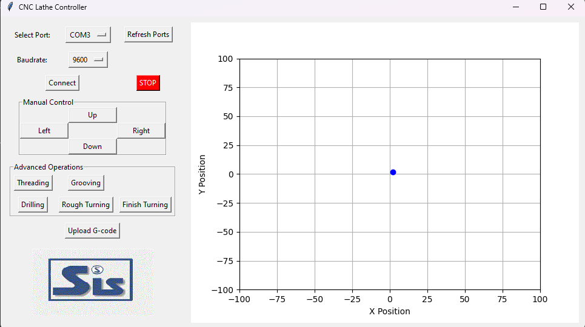

The CNC Lathe Control Software is designed to operate a CNC lathe machine, enabling it to interpret and execute G-code commands. This software is developed for the Arduino platform, utilizing stepper motors for precise control over the lathe's X and Y axes. The program is responsible for processing various G-code commands to perform linear, circular, and specialized movements such as threading, grooving, and peck drilling. The software facilitates the seamless execution of complex machining tasks by providing a robust and flexible control system.

Features
G-code Parsing: The software can interpret standard G-code commands (e.g., G0, G1, G2, G3) for performing precise movements.
Motor Control: Uses stepper motors for controlling the lathe's movements with configurable parameters for speed and precision.
Special Cycles: Supports special machining cycles such as threading, grooving, roughing, and finishing, which are essential for advanced machining tasks.
Arc and Linear Movement: Can execute both linear (straight) and circular (arc) paths, allowing for more complex machining patterns.
Unit Conversion: Capable of switching between metric and imperial units.
Homing Functionality: Ability to move the machine back to its "home" or starting position, ensuring accurate and repeatable operations.
Hardware Requirements
Arduino Board: The software is designed to run on compatible Arduino boards (e.g., Arduino Uno, Mega).
AFMotor Shield: The program requires a motor shield to interface with the stepper motors.
Stepper Motors: Used for precise control of the lathe's movement along the X and Y axes.
Power Supply: Adequate power to drive the stepper motors and Arduino board.

Software Architecture
The software is divided into several components:

CNC_Lathe.ino: The main program file that initializes the system and handles serial communication for G-code commands.
MotorControl.h & MotorControl.cpp: These files contain functions to control the motors, execute linear and arc movements, and perform special machining cycles.
GCodeParser.h & GCodeParser.cpp: Responsible for parsing G-code commands and invoking the appropriate motor control functions.
Config.h: Contains configuration parameters like motor steps per revolution, default speeds, and unit conversion settings.

2. Python Interface Program for CNC Lathe Control
In addition to the Arduino software, a Python interface program can be developed to provide a user-friendly way to send G-code commands to the CNC lathe and monitor its status. This interface can be used for automated control, real-time monitoring, and easier setup of machining jobs.
